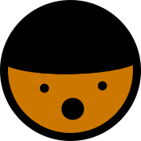

<p align="center">
    
</p>

# 🌟 Ted Super 🌟 
A "retcon" and re-imagining of my Discord bot in Python. This version of the bot will be more focused on minigames and interactions between server members.
Written using [Pycord](https://github.com/Pycord-Development/pycord).

## 🛠 Development Setup
**Note: These instructions assume you are using a Linux system, or Windows via WSL. Change any instructions to fit your operating system as needed.**

To get started, [create a Discord application](https://discord.com/developers/applications) and add a bot user for it. Then, scroll down and make sure the **"Message content intent"** option is toggled on. Finally, add the bot to your server of choice.

After you've made your application, clone this repo somewhere on your machine, then create a file in the root of the project directory called `bot_settings.toml`. This will contain all the settings required for the bot.

The file should contain at least the settings below. An example file has also been provided in the project directory.
```toml
[bot]
token = "your token here"
```

Dependencies are handled by [Rye](https://github.com/mitsuhiko/rye), a new and experimental Python package management solution. Install Rye on your machine by following the instructions in the linked repo, then `cd` into the root of the project directory and run `rye sync`. This will install all of the dependencies in a `.venv` folder, which you can add as the project interpreter in VSCode or a Python IDE.

To run the bot, `cd` into the root of the project directory and run `rye run python -m ted_super`. Or, assuming you have `~/.rye/shims` in your `PATH`, you can simply run `python -m ted_super`. If everything has worked, you'll be greeted by an ASCII Ted!